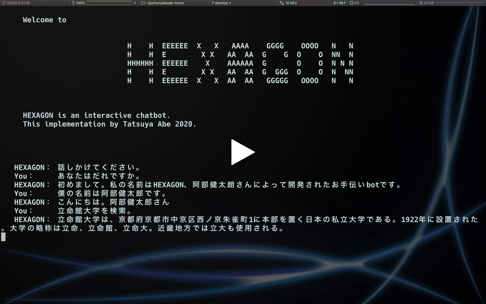

Abelab Home
===========

[](https://github.com/AjxLab/abelab-home/actions)
[](LICENSE)

Smart speaker without triggers working for my home.

It has a [hexagon](https://github.com/AjxLab/hexagon) interactive bot engine.


## Demo
[](https://streamable.com/e/njvovx)


## Requirements
* Raspbian 4.19
* Python 3.7


## Usage
### Use Docker
```sh
$ docker-compose up -d
```
### Not Use Docker
```sh
$ ./abelab-home.py
```


## Installation
```sh
$ git clone <this repo>
$ cd <this repo>
```


## Author
* Tatsuya Abe
* ```abe12<at>mccc.jp```
